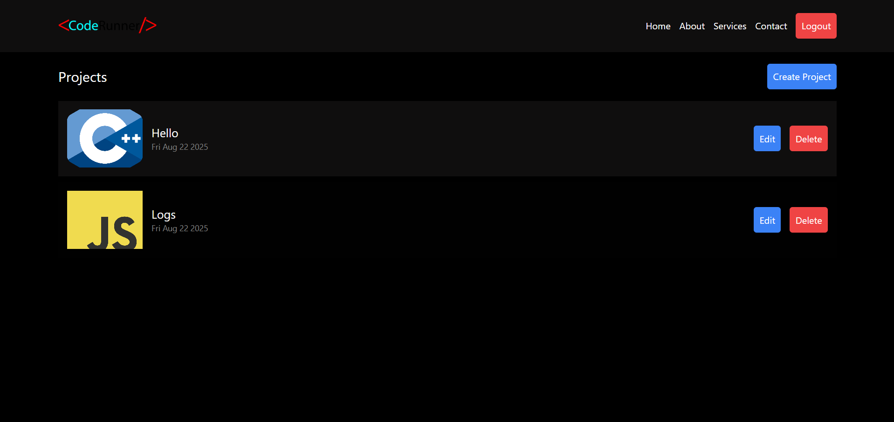
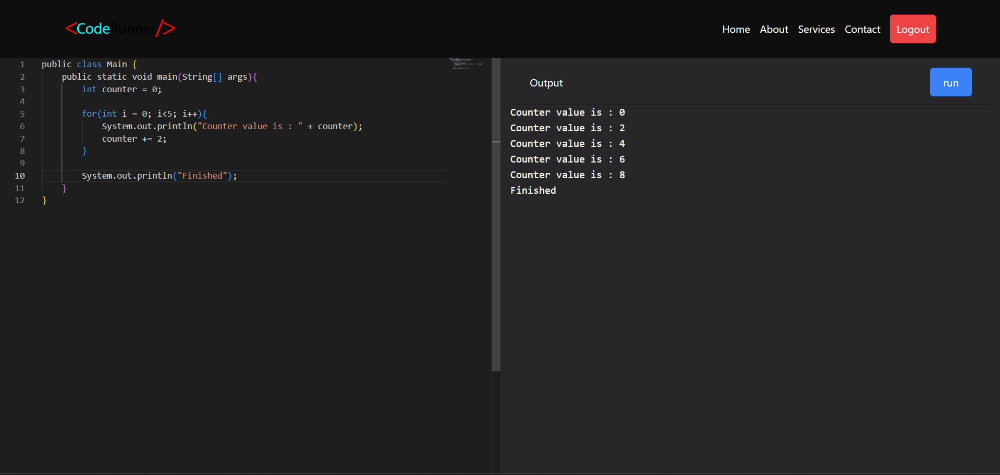
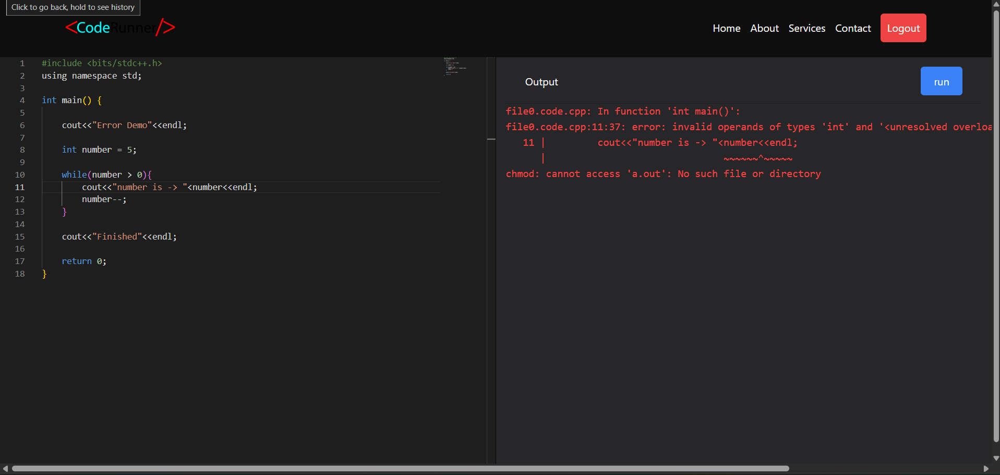
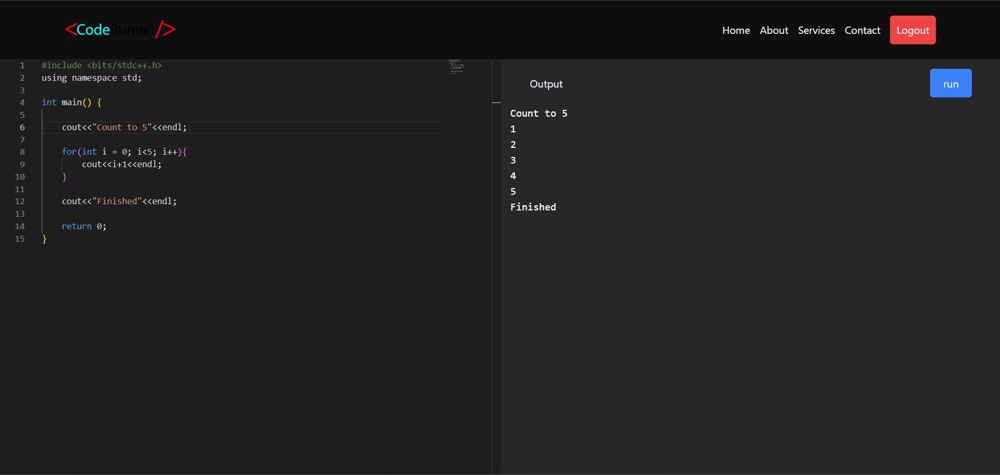
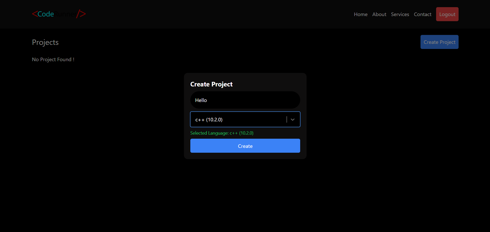
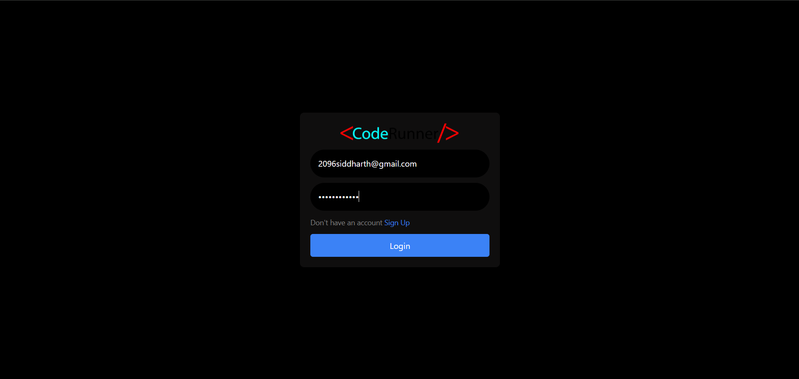
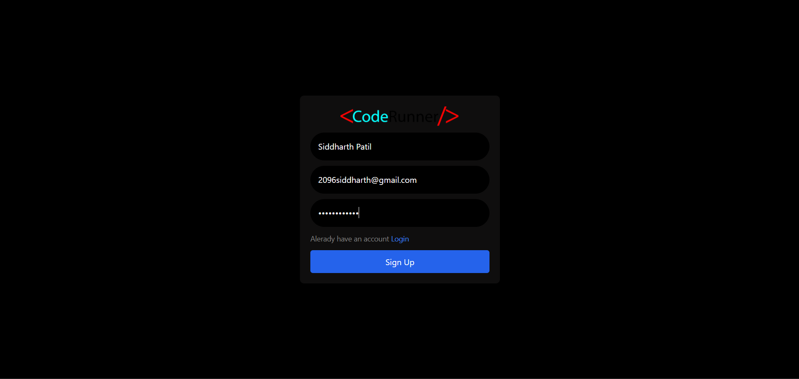

# CodeRunner

**Store, edit, and execute your code templates in multiple languages — all in one place.**  
A simple and efficient CRUD-based web app with authentication and code execution support.

🔗 **Live Demo:** [CodeRunner](https://code-runner-zkom.vercel.app)

---

## ✨ Features

- 📝 Create, edit, delete, and organize code templates
- ⚡ Execute code in multiple languages via **Piston API**
- 🔑 Secure authentication with **JWT**
- 🖥️ Integrated **Monaco Editor** for a smooth coding experience
- 📂 Manage templates across languages (C++, Java, Python, JavaScript, Go, etc.)

---

## 🚀 Tech Stack

- **Frontend:** React, Next.js
- **Backend:** Node.js, Express
- **Database:** MongoDB
- **Authentication:** JWT
- **Editor:** Monaco Editor
- **Execution Engine:** Piston API
- **Hosting:** Vercel

---

## 📸 Screenshots

| Home                            | Java Template                   | Error Screen                      |
| ------------------------------- | ------------------------------- | --------------------------------- |
|  |  |  |

| C++ Template                  | Create Project                                      | Login                             | Signup                              |
| ----------------------------- | --------------------------------------------------- | --------------------------------- | ----------------------------------- |
|  |  |  |  |

---

## 📦 Installation

1. Clone the repository:
   ```bash
   git clone https://github.com/your-username/code-runner.git
   cd code-runner
   ```
